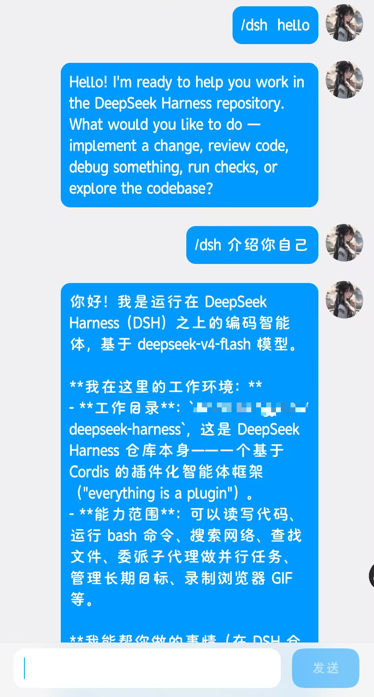
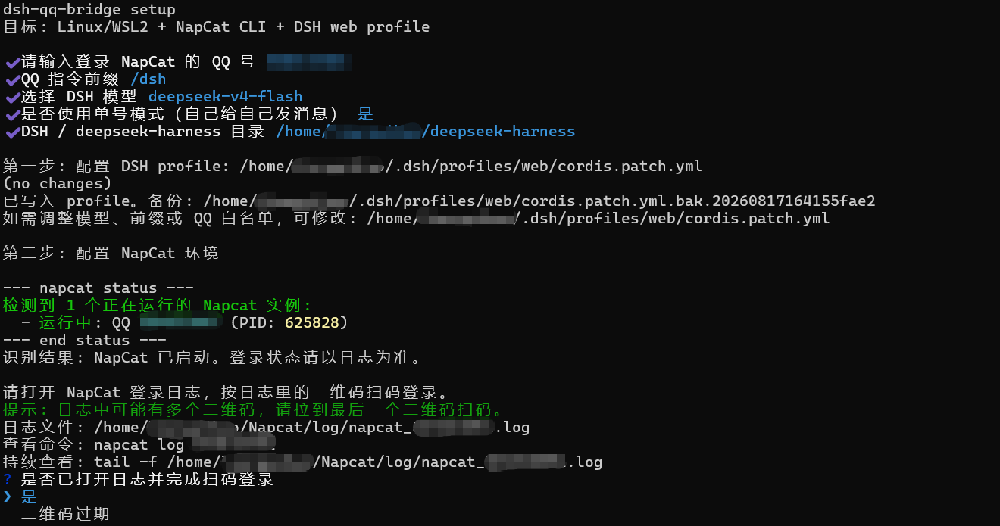
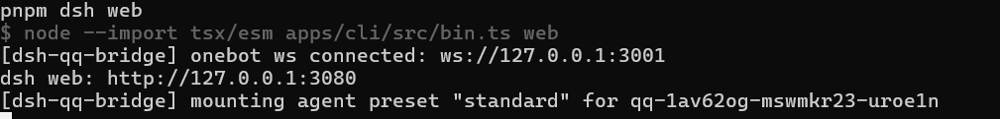

# dsh-qq-bridge

## 效果展示



从 clone 到 QQ 遥控 DSH 的最短流程。目标是:

```text
QQ 发送 /dsh ... -> NapCat -> dsh-qq-bridge -> DSH Agent -> QQ 回复
```

推荐先用**一个 QQ 号**登录 NapCat，然后从手机 QQ 给自己发送 `/dsh ...`。这样不需要准备机器人小号和主号两个账号。

当前不支持通过 QQ 的“我的电脑”会话交互；“我的电脑”里的消息可以被日志捕获，但回复会回到当前 QQ 自身，交互链路不完整。

项目背景和架构说明见 [`docs/project-overview.md`](docs/project-overview.md)。

## 0. 准备

- Node.js 20+ 和 npm。
- 一个 QQ 号，用手机扫码登录 NapCat。
- 已安装好的 DSH / DeepSeek Harness，且知道它的项目目录。
- DeepSeek API Key 已按 DSH 自身方式配置好。

> 您可以将本项目（本文件）交给 agent，让 Ta 帮您完成大部分配置工作。您只需按终端向导输入 QQ 号、选择模型、扫码登录 NapCat。

## 1. 安装 NapCat CLI

`setup` 需要系统里已有 `napcat` 命令。如果尚未安装，Linux / WSL2 推荐:

```bash
cd ~
curl -o napcat.sh https://raw.githubusercontent.com/NapNeko/NapCat-Installer/main/script/install.sh
bash napcat.sh --docker n --cli y
```

安装完成后确认命令可用:

```bash
napcat help
```

>注意:不要运行 `nc`。在 Debian / Ubuntu 上，`nc` 通常是 OpenBSD netcat，不是 NapCat。

## 2. 构建并运行向导

```bash
git clone https://github.com/TomoyoNatsume/dsh-qq-bridge.git
cd dsh-qq-bridge
npm install
npm run build
node dist/main.js setup
```

`npm run build` 成功后也会提示下一步执行 `node dist/main.js setup`。如果已经 `npm link` 或全局安装，也可以直接运行: `dsh-qq-bridge setup`



向导会完成这些事:

- 校验 QQ 号格式、DSH / DeepSeek Harness 目录、NapCat 根目录。
- 用上下键选择模型、是否启用单号模式、是否后台启动 DSH web。
- 生成并写入 `~/.dsh/profiles/web/cordis.patch.yml`，只增改 `insert` 下的 `id: dsh-qq-bridge`，并保留写入前备份。
- 检查 `napcat status <QQ>`；未启动时自动执行 `napcat start <QQ>`。
- 打印 NapCat 日志路径和 `napcat log <QQ>`，让你自己打开日志扫码登录。
- 自动配置 NapCat OneBot 正向 WebSocket: `127.0.0.1:3001`。
- 可选后台启动 `pnpm dsh web`；如果 `http://127.0.0.1:3080` 已经可访问，会跳过启动，避免重复起服务。

在普通终端中，选项题支持上下键选择、回车确认；如果运行环境不支持交互式 TTY，会自动退回到输入序号/文本的模式。输入不合法时会重复当前问题，不会直接退出。

扫码登录时请打开向导打印的日志。日志里可能有多个二维码，请拉到最后一个二维码扫码；如果二维码过期，在向导里选择“二维码过期”，它会重启 NapCat 生成新的登录请求。

向导写入配置后会提示可修改的文件: `~/.dsh/profiles/web/cordis.patch.yml`

如果最后选择后台启动 DSH web，看到类似下面输出即表示服务已启动:

```text
DSH web 已后台启动。PID: 12345
地址: http://127.0.0.1:3080
日志: /tmp/dsh-qq-bridge-dsh-web.log
```



## 3. 用 QQ 验证

从手机 QQ 给自己发送:

```text
/dsh ping
```

如果发送 `/dsh ping` 后没有响应，请先查看 NapCat 日志，确认 QQ 是否仍然登录成功:

```bash
napcat log <你的QQ号>
```

能收到回复后，再试:

```text
/dsh 当前工作目录是什么
/dsh 列出当前工作目录下的目录和文件
```

## 4. 更改配置

正式接入 DSH 时，主要改这个文件:

```text
~/.dsh/profiles/web/cordis.patch.yml
```

改完配置后需要**重启 DSH** 才会生效；只有改了本项目 `src/` 源码时，才需要重新执行 `npm run build`。

### 更改调用的 DSH 模型

修改 `agent.provider` 和 `agent.model`:

```yaml
agent:
  provider: deepseek-official
  model: deepseek-v4-pro
  preset: standard
```

- `provider`:DSH 里已配置好的模型提供方。
- `model`:该 provider 下的模型 id。
- `preset`:DSH agent preset，通常保持 `standard` 即可。

### 更改 QQ 指令前缀

修改 `access.commandPrefix`:

```yaml
access:
  adminQq: <你的QQ号>
  allowlist: []
  commandPrefix: /dsh
  mode: whitelist
```

例如改成 `/ai` 后，QQ 里就要发送:

```text
/ai ping
```

如果开启了单号模式的 `selfLogInput`，它会复用同一个 `commandPrefix`，不需要额外改一处。

### 更改允许使用机器人的 QQ

只允许自己使用时:

```yaml
access:
  adminQq: <你的QQ号>
  allowlist: []
  mode: whitelist
```

要额外允许其他 QQ 使用，把 QQ 号加到 `allowlist`:

```yaml
access:
  adminQq: <你的QQ号>
  allowlist: [10001, 10002]
  mode: whitelist
```

不建议把 `mode` 改成 `open`，除非你明确知道风险。

### 更改单号模式日志路径

如果你用“自己给自己发消息”的单号模式，保持:

```yaml
selfLogInput:
  enabled: true
  logPath: /home/<你的Linux用户名>/Napcat/log/napcat_<你的QQ号>.log
  pollIntervalMs: 1000
  replayOnStart: false
```

如果你是“主号发给机器人小号”，通常可以删除 `selfLogInput`，或改成:

```yaml
selfLogInput:
  enabled: false
```

### 本地回显测试入口的配置

只有运行 `dsh-qq-bridge echo`、`bash scripts/start-local-echo.sh` 或 `npm start` 这种不接 DSH Agent 的本地测试入口时，才用环境变量改配置:

```bash
DSH_QQ_WS_URL=ws://127.0.0.1:3001 \
DSH_QQ_ADMIN=<你的QQ号> \
DSH_QQ_PREFIX=/dsh \
DSH_QQ_SELF_LOG=true \
dsh-qq-bridge echo
```

正式使用 `pnpm dsh web` 时，以 `cordis.patch.yml` 为准。

## 5. 安全防护

这个项目的目标是“私用 QQ 遥控自己的 DSH”，默认按本机私有服务来设计。建议保持下面这些防护措施。

### 只允许指定 QQ 触发

插件入口有一层 `AccessGate`，默认使用白名单模式:

```yaml
access:
  adminQq: <你的QQ号>
  allowlist: []
  commandPrefix: /dsh
  mode: whitelist
```

- `adminQq`:拥有者 QQ，总是放行。
- `allowlist`:额外允许的 QQ 列表，默认空数组。
- `mode: whitelist`:只允许 `adminQq` 和 `allowlist` 里的 QQ 触发。

不要在正式使用中把 `mode` 改成 `open`。`open` 表示任何能给这个 QQ 发消息的人都可能触发 DSH，只适合临时调试。

### 必须带指令前缀

只有以 `commandPrefix` 开头的消息才会进入 DSH:

```yaml
commandPrefix: /dsh
```

普通聊天、群消息、无关消息不会被处理。改成 `/ai`、`/bot` 等其它前缀也可以，但发送时必须同步改成新的前缀。

### OneBot 端口只监听本机

NapCat 的正向 WebSocket 推荐这样配置:

```text
监听地址: 127.0.0.1
端口: 3001
access token: <随机 token>
```

`127.0.0.1` 表示只允许本机连接，不对局域网或公网开放。插件侧也连接本机地址:

```yaml
napcat:
  wsUrl: ws://127.0.0.1:3001
  token: !!js process.env.DSH_QQ_TOKEN
```

不要把 NapCat OneBot WS 监听地址改成 `0.0.0.0` 或公网 IP，除非你已经准备好防火墙、内网/VPN 隔离和强 token。

### OneBot access token 不写进仓库

`DSH_QQ_TOKEN` 是 NapCat 正向 WebSocket 的 access token，不是 WebUI 登录链接里的 token。README 示例用环境变量注入:

```bash
export DSH_QQ_TOKEN='<NapCat OneBot access token>'
```

这样 token 不会写进 `cordis.patch.yml`、Git 历史或 release 包。不要把 QQ 凭据、NapCat WebUI token、OneBot access token、DeepSeek API Key 提交到仓库。

### shell handler 默认关闭

配置示例里保持:

```yaml
shell:
  enabled: false
```

也就是说 QQ 消息默认不会直接执行 shell 命令。即使你之后扩展 shell 能力，也应继续保持 `whitelist`、强指令前缀和 DSH 自身的权限控制。

### 单号模式不回放历史日志

单号模式下 `selfLogInput` 会读取 NapCat 日志，把“自己给自己”的 `/dsh ...` 转成内部消息。默认配置是:

```yaml
selfLogInput:
  replayOnStart: false
```

这能避免 DSH 重启时把历史 `/dsh` 消息重新执行一遍。除非你明确要调试历史日志，否则不要改成 `true`。

### DSH 工具权限需要谨慎

文档里使用:

```bash
export DSH_PERMISSION_MODE=danger-full-access
```

这是为了私用场景下让 DSH Agent 不再卡在工具审批。它本身权限很高，所以必须和 `whitelist`、`adminQq`、本机端口监听、OneBot token 一起使用；不要在开放 QQ 入口或公网端口时启用。

## 6. 停止 DSH

如果是前台运行的 `pnpm dsh web`，在终端按:

```text
Ctrl+C
```

如果你把它放到后台运行了，再查进程:

```bash
ps -eo pid,ppid,lstart,cmd | grep -E 'pnpm dsh web|apps/cli/src/bin.ts' | grep -v grep
```

停止:

```bash
kill <PID>
```

这里要 kill 的是 `ps` 查到的实际进程 PID，不一定是 shell 打印的 job id。

## 7. 开源许可与致谢

本项目使用 MIT License 发布，见 [`LICENSE`](LICENSE)。

发布 release 时建议保留以下文件:

- [`LICENSE`](LICENSE):本项目许可证。
- [`THIRD_PARTY_NOTICES.md`](THIRD_PARTY_NOTICES.md):第三方依赖、协议与外部项目说明。

本项目会连接或参考以下项目/协议:

- [NapCatQQ](https://github.com/NapNeko/NapCatQQ):提供 QQ / OneBot 运行端点。本项目不打包、不修改、不再分发 NapCatQQ，只要求用户自行安装并运行。NapCatQQ 使用自定义的 Limited Redistribution License，若未来 release 中包含 NapCatQQ 文件，必须额外遵守其上游许可证与非商业/再分发限制。
- [OneBot](https://github.com/botuniverse/onebot):聊天机器人接口标准，本项目通过 OneBot WebSocket 协议与 NapCat 通信。
- [DeepSeek Harness / DSH](https://github.com/deepseek-ai/deepseek-harness):本插件运行所在的 Host / Agent 环境。
- `ws`、`zod` 等 npm 依赖:详见 [`THIRD_PARTY_NOTICES.md`](THIRD_PARTY_NOTICES.md)。

简单说:需要 mention。对 `ws`、`zod` 这类依赖，保留 package metadata 和 third-party notices 即可；对 NapCatQQ 这类没有打包进本仓库但对项目很关键的外部运行时，README 里做清晰致谢和边界说明最稳。

## 8. 常见问题

### QQ 消息没回复

先看日志:

```bash
napcat log <你的QQ号>
```

重点检查:

- NapCat 是否还在线。
- 正向 WebSocket 是否开启，端口是否是 `3001`。
- `DSH_QQ_TOKEN` 是否等于 OneBot access token。
- 消息是否以 `/dsh` 开头。
- `adminQq` 是否填的是发消息的 QQ。
- 单号模式下 `selfLogInput.logPath` 是否正确。

### 发送后一直无回复

如果 DSH 卡在工具审批，通常是没有设置:

```bash
export DSH_PERMISSION_MODE=danger-full-access
```

重新 kill 旧进程，再按向导启动，或手动执行 `pnpm dsh web`。

### 临时调试时想用一次性 patch 启动

正式使用建议写入 `~/.dsh/profiles/web/cordis.patch.yml` 后执行 `pnpm dsh web`。临时调试时，也可以把同样的 patch 写到 `/tmp/dsh-qq-bridge-agent.patch.yml`，然后从 DSH 项目目录执行:

```bash
export DSH_QQ_TOKEN='<NapCat OneBot access token>'
export DSH_PERMISSION_MODE=danger-full-access

pnpm dsh web --patch /tmp/dsh-qq-bridge-agent.patch.yml
```

如果需要后台运行并写日志:

```bash
pnpm dsh web --patch /tmp/dsh-qq-bridge-agent.patch.yml \
  > /tmp/dsh-qq-agent.log 2>&1 &
```

### 返回 `<tool_calls>` 或 DSML 文本

通常是模型/工具调用模式不匹配，或插件版本不是最新构建。先执行:

```bash
npm run build
```

然后重启 DSH。推荐使用已验证过的 `deepseek-v4-pro` 配置。

### 只想测试 QQ 链路，不接 DSH Agent

可以用本地回显模式:

```bash
DSH_QQ_ADMIN=<你的QQ号> \
DSH_QQ_TOKEN=<NapCat OneBot access token> \
DSH_QQ_SELF_LOG=true \
bash scripts/start-local-echo.sh
```

发送:

```text
/dsh ping
```

预期回复:

```text
echo: ping
```
